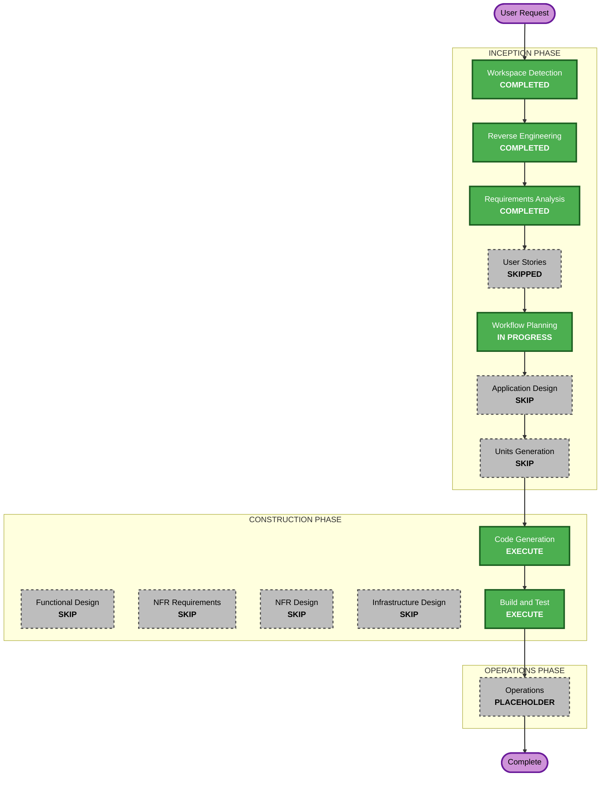

# Execution Plan — História #14 (Registrar Doação)

## Detailed Analysis Summary

### Transformation Scope (Brownfield)
- **Transformation Type**: Single component change (dentro do app `core` já existente)
- **Primary Changes**: Adicionar `DoacaoForm` (core/forms.py), views `doacao_create` (core/views.py), rota `doacoes/nova/` (core/urls.py), template `doacao_form.html`, ativar link "Movimentações" na sidebar, botão "+ Doação" em `item_list.html`, testes em `core/tests.py`.
- **Related Components**: Nenhum além de `core` — `Doacao` já é modelo migrado, `Item.saldo_atual` já resolve o cálculo de saldo.

### Change Impact Assessment
- **User-facing changes**: Sim — novo formulário "Nova Doação", link ativo no menu, botão de atalho em Itens.
- **Structural changes**: Não — nenhuma mudança de arquitetura.
- **Data model changes**: Não — `Doacao` e seus campos já existem e já estão migrados (0001_initial); nenhuma nova migração necessária.
- **API changes**: Sim, menor — uma nova rota web (`doacoes/nova/` → `doacao_create`), seguindo exatamente o padrão das rotas de criação já existentes.
- **NFR impact**: Menor — cobertura das regras aplicáveis de Security Baseline (validação de input, controle de acesso, tratamento de erros, auditabilidade) já mapeada em `requirements.md`; nenhuma decisão de tech stack nova.

### Component Relationships
- **Primary Component**: `core` (app Django)
- **Infrastructure Components**: Nenhum
- **Shared Components**: `Doacao`, `Item`, `Doador`, `Usuario` (models já existentes, reutilizados sem alteração)
- **Dependent Components**: `templates/partials/_sidebar.html` (ativação de link), `templates/core/item_list.html` (novo botão de atalho)
- **Supporting Components**: `core/decorators.py` (`login_obrigatorio`, reutilizado sem alteração)

### Risk Assessment
- **Risk Level**: Low — mudança isolada, segue padrão de CRUD já usado 4x no projeto (Doador, Família, Categoria, Item), sem alteração de schema.
- **Rollback Complexity**: Easy — reverter o commit remove form/view/url/template novos; model e migração pré-existentes não são tocados.
- **Testing Complexity**: Simple — mesmo padrão de `DoadorTestCase`/`ItemTestCase` já presente em `core/tests.py`.

## Workflow Visualization



### Text Alternative
```
INCEPTION: Workspace Detection (DONE) -> Reverse Engineering (DONE) ->
           Requirements Analysis (DONE) -> User Stories (SKIPPED) ->
           Workflow Planning (IN PROGRESS) -> Application Design (SKIP) ->
           Units Generation (SKIP)
CONSTRUCTION: Functional Design (SKIP) -> NFR Requirements (SKIP) ->
              NFR Design (SKIP) -> Infrastructure Design (SKIP) ->
              Code Generation (EXECUTE) -> Build and Test (EXECUTE)
OPERATIONS: Operations (PLACEHOLDER)
```

## Phases to Execute

### INCEPTION PHASE
- [x] Workspace Detection (COMPLETED)
- [x] Reverse Engineering (COMPLETED)
- [x] Requirements Analysis (COMPLETED)
- [x] User Stories (SKIPPED — backlog.md #14 já é uma história de usuário completa com critérios de aceite; requirements.md já a referencia)
- [x] Execution Plan (IN PROGRESS)
- [ ] Application Design — **SKIP**
  - **Rationale**: Nenhum componente/serviço novo; `Doacao` já existe como model. A mudança fica inteiramente dentro dos limites do app `core` já existente, reutilizando o mesmo padrão de Form/View/URL/Template de Doador/Família/Item.
- [ ] Units Generation — **SKIP**
  - **Rationale**: Implementação simples e direta, um único pacote (`core`), sem necessidade de decompor em múltiplas unidades de trabalho.

### CONSTRUCTION PHASE
- [ ] Functional Design — **SKIP**
  - **Rationale**: Sem lógica de negócio nova a projetar — `Item.saldo_atual` já calcula o saldo via agregação; a validação do form (quantidade > 0, data ≤ hoje) é trivial e segue exatamente o padrão de `clean_<campo>` já usado em `DoadorForm`/`ItemForm`.
- [ ] NFR Requirements — **SKIP**
  - **Rationale**: Stack tecnológica já definida (Django/PostgreSQL), sem novas escolhas de tecnologia. As regras aplicáveis de Security/Resiliency Baseline já foram mapeadas e escopadas em `requirements.md` (tabelas de compliance) — não há nova decisão de NFR a tomar, apenas implementar seguindo os padrões já existentes no código (forms com validação, decorators de acesso).
- [ ] NFR Design — **SKIP**
  - **Rationale**: Consequência do skip de NFR Requirements — não há padrão de NFR novo a incorporar além do que já existe no projeto.
- [ ] Infrastructure Design — **SKIP**
  - **Rationale**: Nenhuma mudança de infraestrutura; aplicação continua rodando no mesmo processo Django/Gunicorn já configurado.
- [ ] Code Generation — **EXECUTE (ALWAYS)**
  - **Rationale**: Implementação do form, view, URL, template e testes.
- [ ] Build and Test — **EXECUTE (ALWAYS)**
  - **Rationale**: Rodar migrations (nenhuma nova esperada), testes automatizados (`manage.py test`) e lint (`ruff`).

### OPERATIONS PHASE
- [ ] Operations — PLACEHOLDER

## Estimated Timeline
- **Total Phases Executed**: 2 (Code Generation, Build and Test) + Requirements/Reverse Engineering já concluídas
- **Estimated Duration**: Sessão única (feature pequena, ~5 pontos no backlog)

## Success Criteria
- **Primary Goal**: Voluntário/Administrador consegue registrar uma doação (doador + item + quantidade + data) e o saldo do item reflete o acréscimo imediatamente.
- **Key Deliverables**: `DoacaoForm`, view `doacao_create`, rota `doacoes/nova/`, template `doacao_form.html`, link ativo "Movimentações" na sidebar, botão "+ Doação" em Itens, testes cobrindo os critérios de aceite da história #14.
- **Quality Gates**: `ruff check` sem erros; `python manage.py test` passando (incluindo os novos testes); nenhuma migração pendente (`makemigrations --check`).
