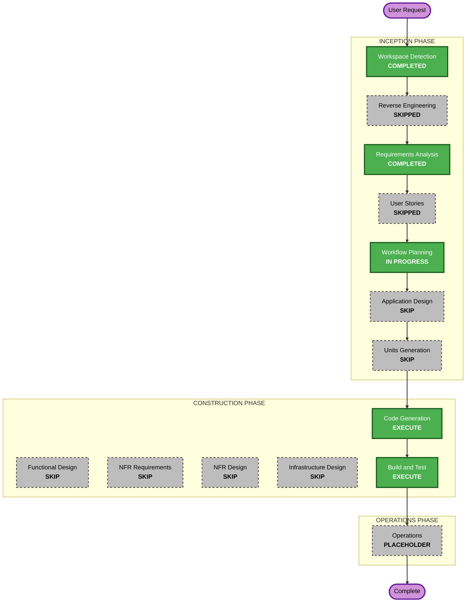

# Execution Plan — História #17 (Ver Saldo Disponível no Formulário de Distribuição)

## Detailed Analysis Summary

### Transformation Scope (Brownfield)
- **Transformation Type**: Single component change (dentro do app `core` já existente), puramente de apresentação
- **Primary Changes**: Ajustar view `distribuicao_create` (contexto extra `itens_saldo`), `DistribuicaoForm` (label do campo `item` com saldo inline), template `distribuicao_form.html` (Info-Box + script), conforme layout do Figma
- **Related Components**: Nenhum além de `core` — reaproveita `Item.saldo_atual` já existente

### Change Impact Assessment
- **User-facing changes**: Sim — melhoria visual/informativa na tela "Nova Distribuição" já existente (história #16)
- **Structural changes**: Não
- **Data model changes**: Não
- **API changes**: Não — mesma rota `distribuicoes/nova/`, sem endpoint novo (decisão de requirements.md: sem AJAX)
- **NFR impact**: Mínimo — XSS mitigado pelo uso do `json_script` nativo do Django

### Component Relationships
- **Primary Component**: `core` (app Django)
- **Shared Components**: `Item` (já existente, sem alteração de schema)
- **Dependent Components**: `templates/core/distribuicao_form.html` (história #16, ajustado nesta história)

### Risk Assessment
- **Risk Level**: Low — mudança de apresentação isolada, sem tocar em persistência/validação de negócio
- **Rollback Complexity**: Easy — reverter o commit remove a alteração; nada de schema envolvido
- **Testing Complexity**: Simple — testes de contexto de view/HTML; interação JS validada manualmente

## Workflow Visualization

```mermaid
flowchart TD
    Start(["User Request"])

    subgraph INCEPTION["INCEPTION PHASE"]
        WD["Workspace Detection<br/><b>COMPLETED</b>"]
        RE["Reverse Engineering<br/><b>SKIPPED</b>"]
        RA["Requirements Analysis<br/><b>COMPLETED</b>"]
        US["User Stories<br/><b>SKIPPED</b>"]
        WP["Workflow Planning<br/><b>IN PROGRESS</b>"]
        AD["Application Design<br/><b>SKIP</b>"]
        UG["Units Generation<br/><b>SKIP</b>"]
    end

    subgraph CONSTRUCTION["CONSTRUCTION PHASE"]
        FD["Functional Design<br/><b>SKIP</b>"]
        NFRA["NFR Requirements<br/><b>SKIP</b>"]
        NFRD["NFR Design<br/><b>SKIP</b>"]
        ID["Infrastructure Design<br/><b>SKIP</b>"]
        CG["Code Generation<br/><b>EXECUTE</b>"]
        BT["Build and Test<br/><b>EXECUTE</b>"]
    end

    subgraph OPERATIONS["OPERATIONS PHASE"]
        OPS["Operations<br/><b>PLACEHOLDER</b>"]
    end

    Start --> WD --> RE --> RA --> US --> WP
    WP --> AD --> UG --> CG
    CG --> BT --> OPS --> End(["Complete"])

    style WD fill:#4CAF50,stroke:#1B5E20,stroke-width:3px,color:#fff
    style RE fill:#BDBDBD,stroke:#424242,stroke-width:2px,stroke-dasharray: 5 5,color:#000
    style RA fill:#4CAF50,stroke:#1B5E20,stroke-width:3px,color:#fff
    style US fill:#BDBDBD,stroke:#424242,stroke-width:2px,stroke-dasharray: 5 5,color:#000
    style WP fill:#4CAF50,stroke:#1B5E20,stroke-width:3px,color:#fff
    style AD fill:#BDBDBD,stroke:#424242,stroke-width:2px,stroke-dasharray: 5 5,color:#000
    style UG fill:#BDBDBD,stroke:#424242,stroke-width:2px,stroke-dasharray: 5 5,color:#000
    style FD fill:#BDBDBD,stroke:#424242,stroke-width:2px,stroke-dasharray: 5 5,color:#000
    style NFRA fill:#BDBDBD,stroke:#424242,stroke-width:2px,stroke-dasharray: 5 5,color:#000
    style NFRD fill:#BDBDBD,stroke:#424242,stroke-width:2px,stroke-dasharray: 5 5,color:#000
    style ID fill:#BDBDBD,stroke:#424242,stroke-width:2px,stroke-dasharray: 5 5,color:#000
    style CG fill:#4CAF50,stroke:#1B5E20,stroke-width:3px,color:#fff
    style BT fill:#4CAF50,stroke:#1B5E20,stroke-width:3px,color:#fff
    style OPS fill:#BDBDBD,stroke:#424242,stroke-width:2px,stroke-dasharray: 5 5,color:#000
    style Start fill:#CE93D8,stroke:#6A1B9A,stroke-width:3px,color:#000
    style End fill:#CE93D8,stroke:#6A1B9A,stroke-width:3px,color:#000

    linkStyle default stroke:#333,stroke-width:2px
```

## Phases to Execute

### INCEPTION PHASE
- [x] Workspace Detection (COMPLETED — reaproveitado)
- [x] Reverse Engineering (SKIPPED — artefatos já existentes)
- [x] Requirements Analysis (COMPLETED, com referência de design do Figma)
- [x] User Stories (SKIPPED — backlog #17 já é história completa com critérios de aceite)
- [x] Execution Plan (IN PROGRESS)
- [ ] Application Design — **SKIP**
  - **Rationale**: Nenhum componente novo; ajuste de apresentação sobre a tela `distribuicao_create` já existente (história #16).
- [ ] Units Generation — **SKIP**
  - **Rationale**: Implementação simples e direta, um único pacote (`core`).

### CONSTRUCTION PHASE
- [ ] Functional Design — **SKIP**
  - **Rationale**: Sem lógica de negócio nova — apenas leitura de `Item.saldo_atual` já existente e exibição.
- [ ] NFR Requirements — **SKIP**
  - **Rationale**: Única consideração de NFR (XSS) já resolvida pelo uso do `json_script` nativo do Django, documentada em requirements.md.
- [ ] NFR Design — **SKIP**
  - **Rationale**: Consequência do skip de NFR Requirements.
- [ ] Infrastructure Design — **SKIP**
  - **Rationale**: Nenhuma mudança de infraestrutura.
- [ ] Code Generation — **EXECUTE (ALWAYS)**
  - **Rationale**: Implementação da view, form, template e testes.
- [ ] Build and Test — **EXECUTE (ALWAYS)**
  - **Rationale**: Rodar `ruff`, `manage.py test`; validação manual do comportamento do JS.

### OPERATIONS PHASE
- [ ] Operations — PLACEHOLDER

## Estimated Timeline
- **Total Phases Executed**: 2 (Code Generation, Build and Test) + Requirements já concluída
- **Estimated Duration**: Sessão única (feature pequena, ~3 pontos no backlog)

## Success Criteria
- **Primary Goal**: Ao selecionar um item no formulário de distribuição, o Voluntário/Administrador vê o saldo disponível daquele item, tanto inline na opção do dropdown quanto em um Info-Box dedicado — replicando o layout do Figma.
- **Key Deliverables**: `distribuicao_create` (contexto `itens_saldo`), `DistribuicaoForm.item` com saldo no rótulo, `distribuicao_form.html` com Info-Box + script, testes cobrindo o contexto/HTML gerado.
- **Quality Gates**: `ruff check` sem erros; `python manage.py test` passando; validação manual do comportamento de `change`/`DOMContentLoaded` no navegador.
