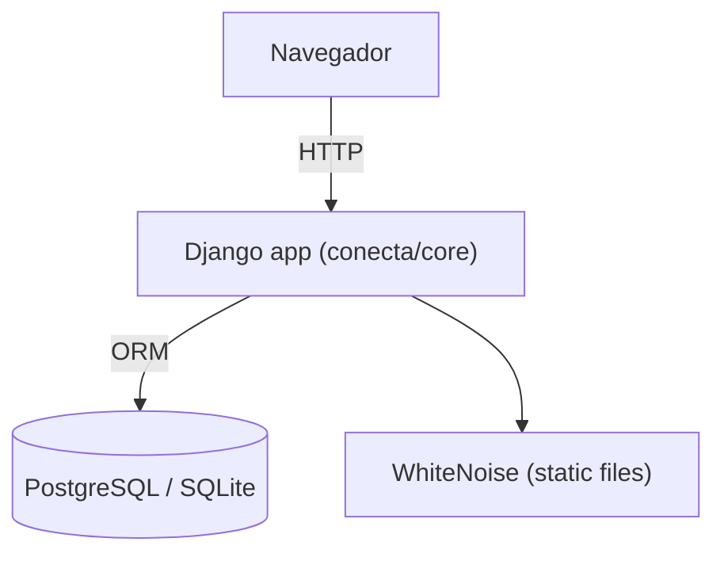
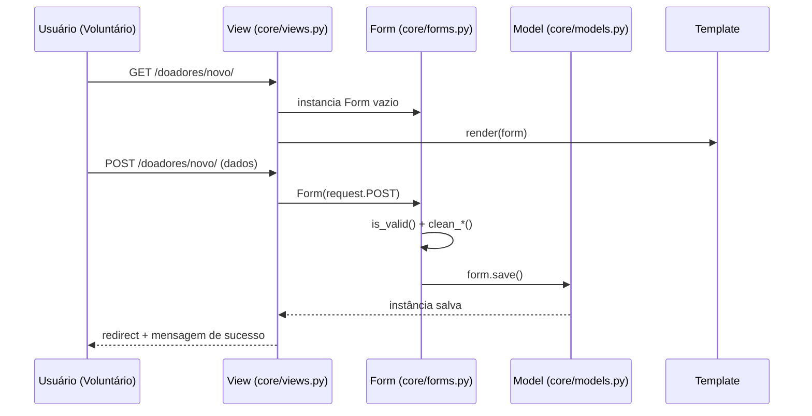

# System Architecture

## System Overview
Aplicação web monolítica Django (padrão MVT), servida por Gunicorn + WhiteNoise, com um único app (`core`) e banco relacional (SQLite em dev, Postgres via `dj-database-url` em produção). Frontend server-side renderizado com templates Django + Tailwind/DaisyUI, sem SPA/API JSON além do endpoint `health`.

## Architecture Diagram

## Component Descriptions

### conecta (projeto Django)
- **Purpose**: Configuração raiz (settings, urls, wsgi/asgi).
- **Responsibilities**: Roteamento raiz, configuração de banco, middlewares, auth.
- **Dependencies**: core
- **Type**: Application (config)

### core (app Django)
- **Purpose**: Implementa todo o domínio de negócio do sistema.
- **Responsibilities**: models, views, forms, urls, decorators de autorização, templates.
- **Dependencies**: Django ORM, django.contrib.auth (customizado via `AUTH_USER_MODEL = core.Usuario`)
- **Type**: Application

## Data Flow (fluxo típico de cadastro/CRUD)

## Integration Points
- **External APIs**: Nenhuma.
- **Databases**: PostgreSQL (produção) via `dj-database-url`; SQLite (dev/local), configurado em `conecta/settings.py`.
- **Third-party Services**: Nenhum.

## Infrastructure Components
- **CDK Stacks**: N/A (sem IaC no repositório).
- **Deployment Model**: Gunicorn + WhiteNoise servindo estáticos; scripts em `scripts/`.
- **Networking**: N/A (fora do escopo do código-fonte analisado).
