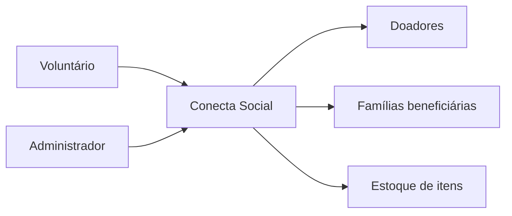

# Business Overview

## Business Context Diagram

### Text Alternative
- Voluntário e Administrador acessam o sistema "Conecta Social".
- O sistema gerencia Doadores, Famílias beneficiárias e Estoque de itens.

## Business Description
- **Business Description**: Conecta Social é um sistema web de gestão de banco de alimentos/doações para uma ONG. Controla doadores, famílias beneficiárias, itens de estoque (por categoria e unidade de medida), e as movimentações de entrada (doações) e saída (distribuições) desse estoque.
- **Business Transactions**:
  - Autenticação e gestão de usuários (login/logout, cadastro de administradores/voluntários)
  - Cadastro de doadores
  - Cadastro de famílias beneficiárias
  - Cadastro de categorias e itens de estoque
  - **Registro de doações (entrada de estoque)** — histórias #14/#15, foco desta tarefa
  - Registro de distribuições (saída de estoque) — histórias #16-#19
  - Relatórios e painel — histórias #20-#23
- **Business Dictionary**:
  - **Doador**: pessoa física/jurídica que doa itens.
  - **Família**: unidade beneficiária que recebe distribuições.
  - **Item**: produto controlado em estoque, pertence a uma Categoria e possui Unidade de Medida.
  - **Doação**: movimentação de entrada de estoque, vincula Doador + Item + Quantidade.
  - **Distribuição**: movimentação de saída de estoque, vincula Família + Item + Quantidade.
  - **Saldo atual**: total de doações não canceladas menos total de distribuições não canceladas de um item.

## Component Level Business Descriptions

### core (Django app)
- **Purpose**: Único app Django do projeto; concentra models, views, forms, urls e templates de todo o domínio de negócio.
- **Responsibilities**: Autenticação, cadastros básicos (doadores, famílias, categorias, itens), movimentações de estoque (doações e distribuições) e controle de saldo.
