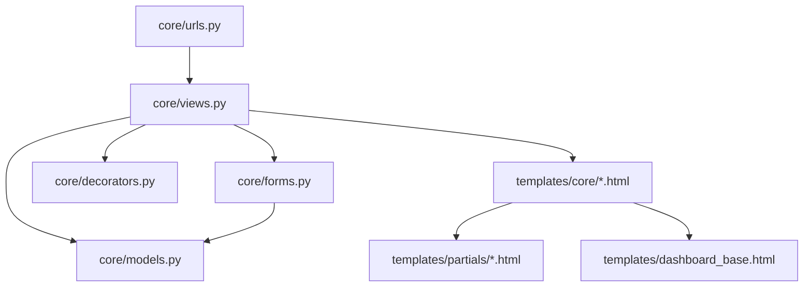

# Code Structure

## Build System
- **Type**: pip / Django management commands (sem Maven/Gradle/npm)
- **Configuration**: `requirements.txt` (deps), `manage.py`, `pyproject.toml`/`ruff` (lint), `.pre-commit-config.yaml`

## Key Modules

### Existing Files Inventory
- `core/models.py` — Modelos de domínio: Usuario, Doador, Familia, CategoriaItem, UnidadeMedida, Item, **Doacao**, Distribuicao. `Doacao` e `Distribuicao` já existem e estão migrados (0001_initial), mas **sem forms/views/urls/templates** — é exatamente o que a história #14 precisa implementar.
- `core/forms.py` — Um `ModelForm` (ou `Form`) por entidade, com classes CSS reutilizáveis (`_CARD_INPUT_CLASS`, `_CARD_SELECT_CLASS`) e `clean_<campo>()` para validações/normalizações e unicidade.
- `core/views.py` — Function-based views agrupadas por seção com separadores `# ---`. Padrão consistente: `<entidade>_create` (GET exibe form vazio / POST valida e salva + `messages.success` + redirect), `<entidade>_list` (busca `q` + paginação de 20), `<entidade>_update` (apenas Administrador em alguns casos).
- `core/urls.py` — Rotas nomeadas em português, plural para listagem (`/doadores/`), `/novo/` ou `/nova/` para criação, `/<pk>/editar/` para edição.
- `core/decorators.py` — `login_obrigatorio` (wrap de `login_required`) e `admin_obrigatorio` (checa `perfil`).
- `core/tests.py` — Um `TestCase` por entidade/feature, nomes de métodos descritivos em português (`test_cadastrar_doador_com_sucesso`), helpers `setUp` criando usuários de teste.
- `templates/dashboard_base.html` — Layout com sidebar (`templates/partials/_sidebar.html`), blocos `title`, `page_title`, `page_subtitle`, `content`.
- `templates/partials/_campo_formulario_dashboard.html` — Partial reutilizável para renderizar um campo de formulário dentro do layout dashboard.
- `templates/core/doador_form.html`, `item_form.html`, `familia_form.html`, `categoria_form.html` — Templates de formulário seguindo o mesmo esqueleto (card branco, `data-testid`, botões Salvar/Cancelar).
- `templates/core/item_list.html`, `doador_list.html`, `familia_list.html`, `categoria_list.html` — Templates de listagem com busca + paginação + tabela.
- `templates/partials/_sidebar.html` — Item "Movimentações" já existe no menu, mas como `` inerte (sem link) — comentário no arquivo explica que vira `<a>` "só se a view já existir". A história #14 é o gatilho para ativar esse link.

## Design Patterns

### Function-Based Views + ModelForm
- **Location**: `core/views.py`, `core/forms.py`
- **Purpose**: CRUD simples e consistente sem a indireção de Class-Based Views.
- **Implementation**: Uma função por operação (create/update/list), `ModelForm` com `Meta.fields`, `widgets`, `labels`, validação extra via `clean_<campo>`.

### Decorator-based Authorization
- **Location**: `core/decorators.py`, aplicado via `@login_obrigatorio` / `@admin_obrigatorio` nas views.
- **Purpose**: Controle de acesso por perfil (Administrador vs Voluntário) sem middleware global.

### Computed Properties para regras de negócio simples
- **Location**: `Item.saldo_atual`, `Item.abaixo_estoque_minimo` (core/models.py)
- **Purpose**: Deriva saldo de estoque a partir de agregações (`Sum`) sobre `Doacao`/`Distribuicao` não canceladas, evitando campo redundante desnormalizado.

## Critical Dependencies
### Django
- **Version**: >=5.2,<6.0
- **Usage**: Framework web completo (ORM, auth, templates, forms).
- **Purpose**: Base do projeto.

### dj-database-url / psycopg
- **Version**: dj-database-url>=2.3,<3; psycopg[binary]>=3.2,<4
- **Usage**: Configuração de banco via `DATABASE_URL`, driver PostgreSQL.
- **Purpose**: Suporte a Postgres em produção mantendo SQLite em dev.

### whitenoise / gunicorn
- **Version**: whitenoise>=6.9,<7; gunicorn>=23,<24
- **Usage**: Servir estáticos e rodar o servidor WSGI em produção.
