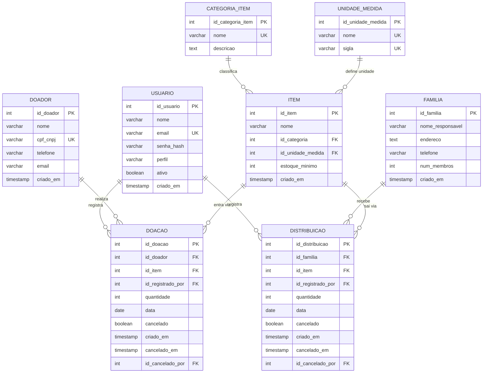

# DER — Conecta Social

**Equipe:**
- Alexandre Victoriano Ribeiro Ulhoa — RA 2840482423007
- Daniel Souza Monteiro de Carvalho — RA 2840482211052
- Cintia Marcelo de Oliveira — RA 2840482421017
- Antonio Pires Felipe — RA 2840482211003
- Luiz Henrique Neres — RA 2840482423005

**Entrega:** E3 — Modelagem de Dados e UML  
**Semestre:** 2026/2

---

## 1. Diagrama

O modelo está normalizado até a **3FN**: atributos atômicos (1FN), chaves simples sem dependências parciais (2FN), e nenhum atributo não-chave dependente transitivamente de outro (3FN). O saldo atual do item é derivado e **não** é persistido — calculado via ORM a partir de `doacao` e `distribuicao`.

> `id_cancelado_por` em `DOACAO` e `DISTRIBUICAO` é FK nullable para `USUARIO` — representa o administrador que realizou o cancelamento. Omitido como linha separada no diagrama para evitar duplicidade visual com "registra".

---

## 2. Dicionário de dados

### Tabela: `usuario`

| Campo | Tipo | Restrições | Descrição |
|---|---|---|---|
| id_usuario | SERIAL | PK | Identificador único auto-incrementado |
| nome | VARCHAR(150) | NOT NULL | Nome completo do usuário |
| email | VARCHAR(255) | NOT NULL, UNIQUE | E-mail de login (único no sistema) |
| senha_hash | VARCHAR(255) | NOT NULL | Hash PBKDF2 da senha |
| perfil | VARCHAR(15) | NOT NULL, CHECK IN ('administrador','voluntario') | Perfil de acesso |
| ativo | BOOLEAN | NOT NULL, DEFAULT TRUE | FALSE impede login sem apagar histórico |
| criado_em | TIMESTAMP | NOT NULL, DEFAULT NOW() | Data/hora de criação |

### Tabela: `doador`

| Campo | Tipo | Restrições | Descrição |
|---|---|---|---|
| id_doador | SERIAL | PK | Identificador único auto-incrementado |
| nome | VARCHAR(150) | NOT NULL | Nome completo ou razão social |
| cpf_cnpj | VARCHAR(18) | NOT NULL, UNIQUE | CPF (XXX.XXX.XXX-XX) ou CNPJ (XX.XXX.XXX/XXXX-XX) |
| telefone | VARCHAR(20) | — | Telefone de contato (opcional) |
| email | VARCHAR(255) | — | E-mail de contato (opcional) |
| criado_em | TIMESTAMP | NOT NULL, DEFAULT NOW() | Data/hora de cadastro |

### Tabela: `familia`

| Campo | Tipo | Restrições | Descrição |
|---|---|---|---|
| id_familia | SERIAL | PK | Identificador único auto-incrementado |
| nome_responsavel | VARCHAR(150) | NOT NULL | Nome do responsável pela família |
| endereco | TEXT | NOT NULL | Endereço completo |
| telefone | VARCHAR(20) | — | Telefone de contato (opcional) |
| num_membros | INTEGER | NOT NULL, CHECK >= 1 | Número de integrantes |
| criado_em | TIMESTAMP | NOT NULL, DEFAULT NOW() | Data/hora de cadastro |

### Tabela: `categoria_item`

| Campo | Tipo | Restrições | Descrição |
|---|---|---|---|
| id_categoria_item | SERIAL | PK | Identificador único auto-incrementado |
| nome | VARCHAR(100) | NOT NULL, UNIQUE | Nome da categoria |
| descricao | TEXT | — | Descrição opcional |

### Tabela: `unidade_medida`

| Campo | Tipo | Restrições | Descrição |
|---|---|---|---|
| id_unidade_medida | SERIAL | PK | Identificador único auto-incrementado |
| nome | VARCHAR(50) | NOT NULL, UNIQUE | Nome por extenso (ex.: Quilograma) |
| sigla | VARCHAR(10) | NOT NULL, UNIQUE | Abreviação exibida (ex.: kg) |

### Tabela: `item`

O saldo atual **não é armazenado** — é calculado via ORM a partir das tabelas `doacao` e `distribuicao`.

| Campo | Tipo | Restrições | Descrição |
|---|---|---|---|
| id_item | SERIAL | PK | Identificador único auto-incrementado |
| nome | VARCHAR(150) | NOT NULL | Nome do item (ex.: Arroz 5kg) |
| id_categoria | INTEGER | NOT NULL, FK categoria_item(id_categoria_item) | Categoria do item |
| id_unidade_medida | INTEGER | NOT NULL, FK unidade_medida(id_unidade_medida) | Unidade de medida do item |
| estoque_minimo | INTEGER | NOT NULL, DEFAULT 0, CHECK >= 0 | Limiar para alerta de saldo baixo |
| criado_em | TIMESTAMP | NOT NULL, DEFAULT NOW() | Data/hora de cadastro |

### Tabela: `doacao`

| Campo | Tipo | Restrições | Descrição |
|---|---|---|---|
| id_doacao | SERIAL | PK | Identificador único auto-incrementado |
| id_doador | INTEGER | NOT NULL, FK doador(id_doador) | Doador que realizou a doação |
| id_item | INTEGER | NOT NULL, FK item(id_item) | Item recebido |
| id_registrado_por | INTEGER | NOT NULL, FK usuario(id_usuario) | Usuário que registrou a entrada |
| quantidade | NUMERIC(10,2) | NOT NULL, CHECK > 0 | Quantidade recebida |
| data | DATE | NOT NULL | Data da doação |
| cancelado | BOOLEAN | NOT NULL, DEFAULT FALSE | Indica cancelamento (estorno) |
| criado_em | TIMESTAMP | NOT NULL, DEFAULT NOW() | Data/hora de registro |
| cancelado_em | TIMESTAMP | — | Data/hora do cancelamento |
| id_cancelado_por | INTEGER | FK usuario(id_usuario) | Administrador que cancelou (nullable) |

### Tabela: `distribuicao`

| Campo | Tipo | Restrições | Descrição |
|---|---|---|---|
| id_distribuicao | SERIAL | PK | Identificador único auto-incrementado |
| id_familia | INTEGER | NOT NULL, FK familia(id_familia) | Família beneficiada |
| id_item | INTEGER | NOT NULL, FK item(id_item) | Item distribuído |
| id_registrado_por | INTEGER | NOT NULL, FK usuario(id_usuario) | Usuário que registrou a saída |
| quantidade | NUMERIC(10,2)| NOT NULL, CHECK > 0 | Quantidade distribuída |
| data | DATE | NOT NULL | Data da distribuição |
| cancelado | BOOLEAN | NOT NULL, DEFAULT FALSE | Indica cancelamento (estorno) |
| criado_em | TIMESTAMP | NOT NULL, DEFAULT NOW() | Data/hora de registro |
| cancelado_em | TIMESTAMP | — | Data/hora do cancelamento |
| id_cancelado_por | INTEGER | FK usuario(id_usuario) | Administrador que cancelou (nullable) |

