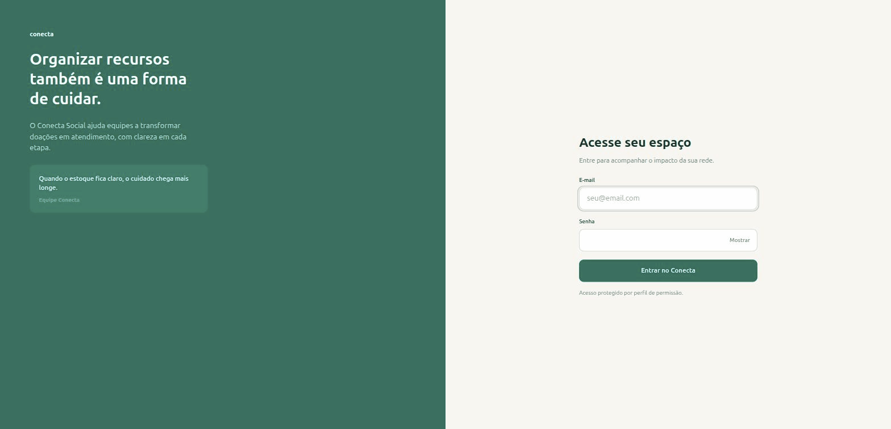
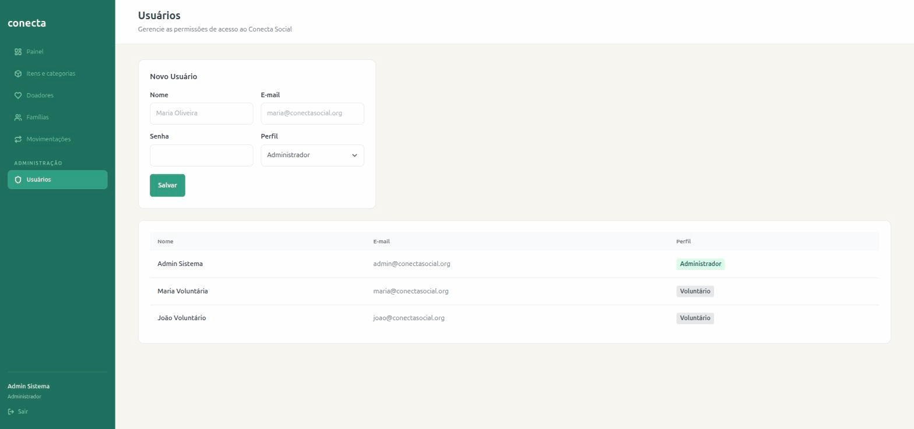

# Relatório de Entrega — Sprint 1 — Conecta Social

**Período:** 11/09/2026 a 18/09/2026 (Sprint 1 comprimida em 1 semana)
**Sprint Review:** [data, com quem]

## 1. Planejado vs. entregue

| História (E2) | Planejada para esta sprint? | Entregue? | Observação |
|---|---|---|---|
| | | | |

## 2. Incremento funcional demonstrável

Login e logout (histórias #1 e #2 do backlog) funcionando de ponta a ponta:
autenticação por e-mail/senha, sessão com expiração por inatividade, painel
protegido por login e logout que encerra a sessão.



Cadastro de usuários (história #3 do backlog) funcionando de ponta a ponta:
sidebar de navegação interna (nova), tela "Usuários" restrita a
Administrador, formulário de novo usuário (nome, e-mail, senha e perfil) e
listagem atualizada após o cadastro.



**Como reproduzir localmente** (passo a passo completo e pré-requisitos no
[`README.md`](../../README.md)):

- **Opção 1 — Docker** (não precisa instalar Python/PostgreSQL):
  ```bash
  docker compose up --build
  ```
  Acesse `http://localhost:8000/login/`.

- **Opção 2 — venv local**:
  ```bash
  source .venv/bin/activate
  python manage.py migrate
  python manage.py seed
  python manage.py runserver
  ```
  Acesse `http://127.0.0.1:8000/login/`.

Nas duas opções, o `seed` cria os mesmos usuários de teste (senha
`alterar-senha` para todos): `admin@conectasocial.org` (Administrador),
`maria@conectasocial.org` ou `joao@conectasocial.org` (Voluntário). Lista
completa em [`README.md` → "Usuários de teste"](../../README.md#usuários-de-teste).

## 3. Backlog atualizado

[Print/link do board ao fim da sprint + lista do que mudou de status]

## 4. Evidências de teste

[Resumo — detalhe completo em `docs/sprints/sprint-1-evidencias-teste.md`]

## 5. Retrospectiva e contribuição individual

- Ata de retrospectiva: [`docs/sprints/sprint-1-retrospectiva.md`](sprint-1-retrospectiva.md)
- Relatórios individuais de contribuição:
  - [Alexandre Ulhoa](sprint-1-contribuicao-alexandre-ulhoa.md)
  - [Daniel Carvalho](sprint-1-contribuicao-daniel-carvalho.md)
  - [Antonio Felipe](sprint-1-contribuicao-antonio-felipe.md)
  - [Luiz Henrique](sprint-1-contribuicao-luiz-henrique.md)

## 6. Riscos/impedimentos para a próxima sprint

-
