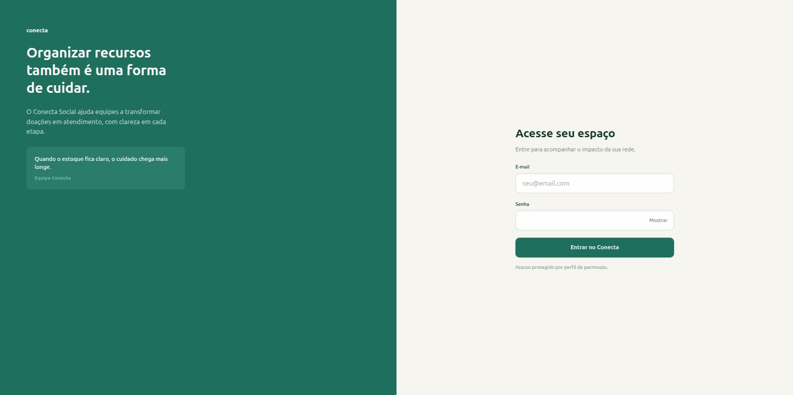
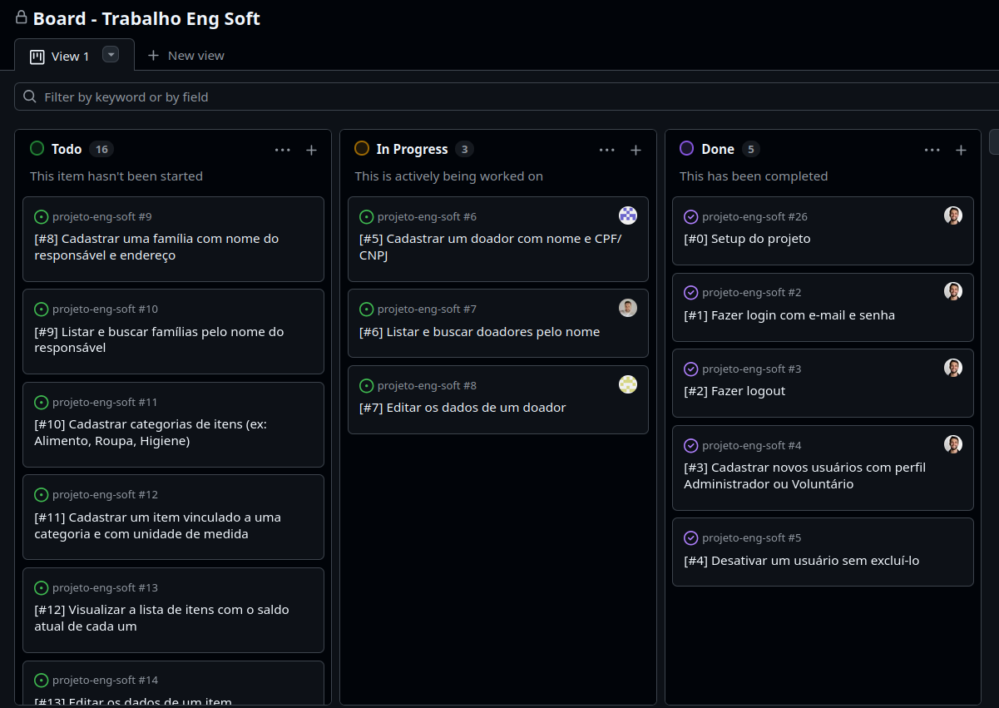

# Relatório de Entrega — Sprint 1 — Conecta Social

**Período:** 11/09/2026 a 18/09/2026 (Sprint 1 comprimida em 1 semana)
**Sprint Review:** [data, com quem]

## 1. Planejado vs. entregue

| História (E2) | Planejada para esta sprint? | Entregue? | Observação |
|---|---|---|---|
| #1 — Login com e-mail e senha | Sim | Sim | — |
| #2 — Logout | Sim | Sim | — |
| #3 — Cadastrar usuários (Administrador/Voluntário) | Sim | Sim | — |
| #4 — Desativar usuário sem excluí-lo | Sim | Sim | — |
| #5 — Cadastrar doador com nome e CPF/CNPJ | Sim | Não | Em progresso ao fim da sprint; passa para a Sprint 2 |
| #6 — Listar e buscar doadores pelo nome | Sim | Não | Em progresso ao fim da sprint; passa para a Sprint 2 |
| #7 — Editar dados de um doador | Sim | Não | Em progresso ao fim da sprint; passa para a Sprint 2 |
| #8 — Cadastrar família com nome do responsável e endereço | Sim | Não | Não iniciada; passa para a Sprint 2 |
| #9 — Listar e buscar famílias pelo nome do responsável | Sim | Não | Não iniciada; passa para a Sprint 2 |
| #10 — Cadastrar categorias de itens | Sim | Não | Não iniciada; passa para a Sprint 2 |
| #11 — Cadastrar item vinculado a categoria e unidade de medida | Sim | Não | Não iniciada; passa para a Sprint 2 |
| #12 — Visualizar lista de itens com saldo atual | Sim | Não | Não iniciada; passa para a Sprint 2 |
| #13 — Editar dados de um item | Sim | Não | Não iniciada; passa para a Sprint 2 |

## 2. Incremento funcional demonstrável

Login e logout (histórias #1 e #2 do backlog) funcionando de ponta a ponta:
autenticação por e-mail/senha, sessão com expiração por inatividade, painel
protegido por login e logout que encerra a sessão.


Cadastro de usuários (história #3 do backlog) funcionando de ponta a ponta:
sidebar de navegação interna (nova), tela "Usuários" restrita a
Administrador, formulário de novo usuário (nome, e-mail, senha e perfil) e
listagem atualizada após o cadastro.


Desativar e reativar usuário sem excluí-lo (história #4 do backlog)
funcionando de ponta a ponta: botão "Desativar" muda o status para Inativo
e passa a exibir "Ativar" no lugar; botão "Ativar" restaura o status para
Ativo, sem perder o cadastro do usuário.



**Como reproduzir localmente** (passo a passo completo e pré-requisitos no
[`README.md`](../../README.md)):

- **Opção 1 — Docker** (não precisa instalar Python/PostgreSQL):
  ```bash
  docker compose up --build
  ```
  Acesse `http://localhost:8000/login/`.

- **Opção 2 — venv local**:
  ```bash
  source .venv/bin/activate
  python manage.py migrate
  python manage.py seed
  python manage.py runserver
  ```
  Acesse `http://127.0.0.1:8000/login/`.

Nas duas opções, o `seed` cria os mesmos usuários de teste (senha
`alterar-senha` para todos): `admin@conectasocial.org` (Administrador),
`maria@conectasocial.org` ou `joao@conectasocial.org` (Voluntário). Lista
completa em [`README.md` → "Usuários de teste"](../../README.md#usuários-de-teste).

## 3. Backlog atualizado



Link do board: https://github.com/users/Antonio-pf/projects/11

Board do projeto ao fim da Sprint 1 (11/09–18/09):

- **Done:** #0 (setup do projeto), #1 (login), #2 (logout), #3 (cadastrar
  usuários), #4 (desativar usuário) — as 4 histórias planejadas do bloco
  "Autenticação e Perfis" foram concluídas.
- **In Progress:** #5 (cadastrar doador), #6 (listar/buscar doadores), #7
  (editar doador) — trabalho iniciado no bloco "Doadores", concluído na
  Sprint 2.
- **Todo:** #8 e #9 (Famílias), #10 a #13 (Categorias e Itens) — ainda não
  iniciadas, também previstas para a Sprint 2.

## 4. Evidências de teste

[Resumo — detalhe completo em `docs/sprints/sprint-1-evidencias-teste.md`]

## 5. Retrospectiva e contribuição individual

- Ata de retrospectiva: [`docs/sprints/sprint-1-retrospectiva.md`](sprint-1-retrospectiva.md)
- Relatórios individuais de contribuição:
  - [Alexandre Ulhoa](sprint-1-contribuicao-alexandre-ulhoa.md)
  - [Daniel Carvalho](sprint-1-contribuicao-daniel-carvalho.md)
  - [Antonio Felipe](sprint-1-contribuicao-antonio-felipe.md)
  - [Luiz Henrique](sprint-1-contribuicao-luiz-henrique.md)

## 6. Riscos/impedimentos para a próxima sprint

-
