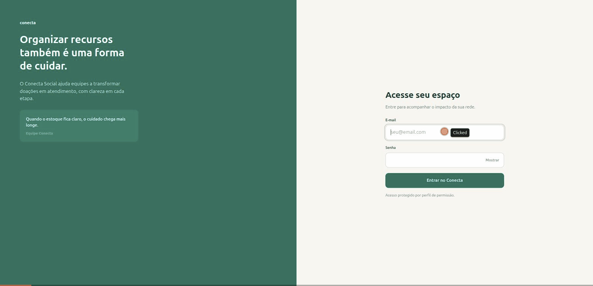
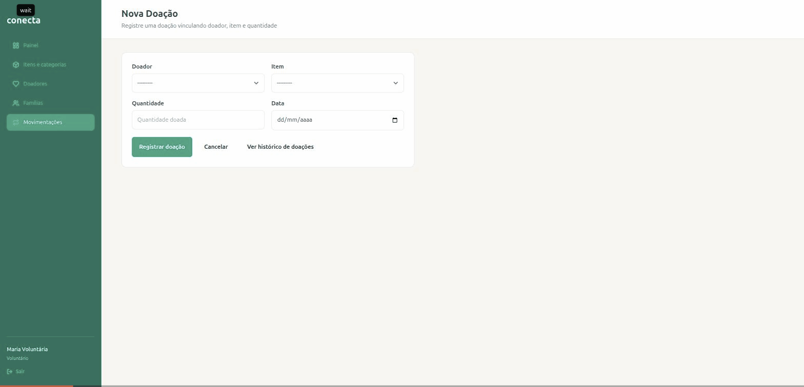
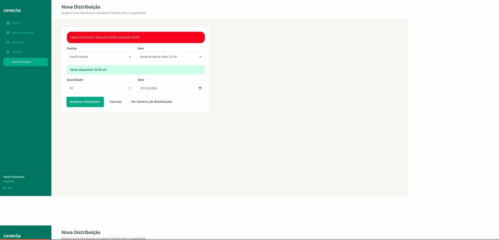
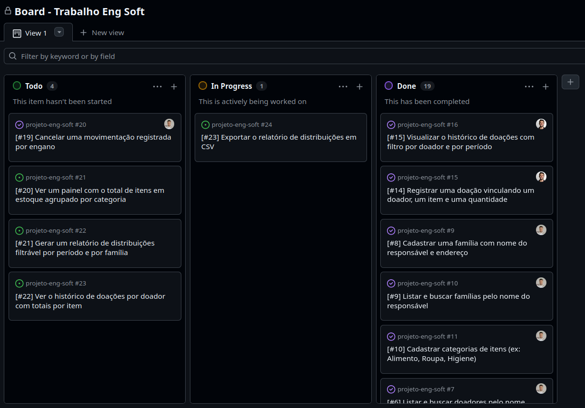

# Relatório de Entrega — Sprint 2 — Conecta Social

**Período:** 25/09/2026 a 02/10/2026 (Sprint 2, semanas 7–8; inclui o trabalho remanescente da Sprint 1 integrado à `main` a partir de 19/09)
**Sprint Review:** 02/10/2026, em sala de aula (Semana 8)

**Equipe:**
- Alexandre Victoriano Ribeiro Ulhoa — RA 2840482423007
- Daniel Souza Monteiro de Carvalho — RA 2840482211052
- Cintia Marcelo de Oliveira — RA 2840482421017
- Antonio Pires Felipe — RA 2840482211003
- Luiz Henrique Neres — RA 2840482423005

## 1. Planejado vs. entregue

| História (E2) | Planejada para esta sprint? | Entregue? | Observação |
|---|---|---|---|
| #14 — Registrar doação (doador, item, quantidade) | Sim | Sim | Integrada à `main` em 24/09 por merge direto da branch `feature/historia-14-registrar-doacao`, sem PR. A quantidade aceita decimais (kg, l), decisão registrada nos requisitos do AI-DLC; o critério de aceite do backlog fala em inteiro. Campo "data" abre com a data de hoje (corrigido em 01/10/2026, ver seção 6) |
| #15 — Histórico de doações com filtro por doador e período | Sim | Sim | PR #35. Filtros isolados e combinados, lista paginada |
| #16 — Registrar distribuição (família, item, quantidade) | Sim | Sim | PR #34. Bloqueia com "Saldo insuficiente: disponível X, solicitado Y". Campo "data" abre com a data de hoje, como na #14 |
| #17 — Saldo do item no formulário de distribuição | Sim | Sim | PR #34. Saldo exibido na opção do item e em caixa de informação ao selecioná-lo |
| #18 — Histórico de distribuições com filtro por família e período | Sim | Sim | PR #35. Filtros isolados e combinados, lista paginada |
| #5 a #7 — Doadores (cadastro, listagem/busca, edição) | Não (remanescentes da Sprint 1) | Sim | PRs #30 e #31 |
| #8 e #9 — Famílias (cadastro, listagem/busca) | Não (remanescentes da Sprint 1) | Sim | PR #31 |
| #10 a #13 — Categorias e itens (cadastro, listagem com saldo, edição) | Não (remanescentes da Sprint 1) | Sim | PR #31 |

## 2. Incremento funcional demonstrável

O sistema está no ar em https://conecta-social-wcxa.onrender.com/ (a primeira requisição após
inatividade leva cerca de 20 s, por causa do plano gratuito da hospedagem). Em 01/10/2026 o
endereço `/health/` respondeu 200 e as rotas `/doacoes/` e `/distribuicoes/` existem no deploy
(redirecionam para o login). Os GIFs abaixo foram gravados rodando o sistema localmente, com a
`main` desta sprint e os dados do comando `seed`.

**Login e navegação entre as telas** (painel, itens e categorias, doadores, famílias e
movimentações), com perfil Voluntário:



**Registrar doação (#14) e histórico com filtros (#15):** o voluntário escolhe doador, item,
quantidade e data; ao salvar, o saldo da "Pasta de dente" passa de 0 para 20 na lista de itens e a
doação aparece no histórico, que é filtrado por doador e por período:



**Registrar distribuição (#16), saldo no formulário (#17) e histórico com filtro (#18):** ao
escolher o item, o formulário mostra o saldo disponível; pedir 50 de um item com saldo 20 é
bloqueado com mensagem de erro; com a quantidade corrigida para 5, o saldo cai de 20 para 15 e a
distribuição aparece no histórico, filtrado por família:



**Como reproduzir localmente** (passo a passo completo e pré-requisitos no
[`README.md`](../../README.md)):

```bash
source .venv/bin/activate
python manage.py migrate
python manage.py seed
python manage.py runserver
```

Acesse `http://127.0.0.1:8000/login/` com um dos usuários de teste do `seed` (lista em
[`README.md` → "Usuários de teste"](../../README.md#usuários-de-teste)). Telas desta sprint:
`/doacoes/nova/`, `/doacoes/`, `/distribuicoes/nova/` e `/distribuicoes/`.

## 3. Backlog atualizado



Link do board: https://github.com/users/Antonio-pf/projects/11

Mudanças de status ao fim da Sprint 2:

- **Done:** #0 a #18. Os cards #15, #16, #17 e #18 estavam desatualizados no board ("In Progress" com
  o código já mesclado) e foram movidos para "Done" em 01/10/2026.
- **Todo:** #19 (cancelar movimentação), #20, #21 e #22, todas previstas para a Sprint 3. O card
  #19 constava como "Done" sem código na `main` e foi devolvido para "Todo" em 01/10/2026.
- **In Progress:** #23 (exportar CSV, Sprint 3) consta assim no board. O código da exportação foi
  integrado à `main` em 02/10/2026 por commit direto (`12ecff3`, Daniel Souza), sem PR e sem
  revisão, e ainda não tem testes automatizados.
- Os cards #16 e #17 foram reatribuídos de Luiz Henrique Neres para Antonio Pires Felipe em
  30/09/2026, porque quem implementou foi o Antonio.

## 4. Evidências de teste

79 testes automatizados (`python manage.py test`), 100% passando em 01/10/2026, sendo 31 novos
desta sprint (doação, distribuição e os dois históricos) e 22 dos cadastros das histórias #5 a #13.
Casos do plano de testes cobertos: CT05 a CT14 e CT22 a CT27. Um ficou parcial: CT08
(paginação de famílias sem teste automatizado).
Detalhe completo em [`sprint-2-evidencias-teste.md`](sprint-2-evidencias-teste.md).

## 5. Retrospectiva e contribuição individual

- Ata de retrospectiva: [`docs/sprints/sprint-2-retrospectiva.md`](sprint-2-retrospectiva.md)
- Relatórios individuais de contribuição:
  - [Antonio Felipe](sprint-2-contribuicao-antonio-felipe.md)

## 6. Riscos/impedimentos para a próxima sprint

- **Revisão de PRs:** os PRs #34 e #35 não têm revisão registrada no GitHub, a história #14 foi
  integrada sem PR e a exportação CSV (#23) entrou na `main` por commit direto (`12ecff3`). A regra
  da disciplina exige PR com revisão de outro integrante antes de qualquer merge.
- **CI quebrado pelo commit direto:** o `12ecff3` deixou `core/views.py` e `core/urls.py` fora do
  formato do `ruff format`, e o job `lint` passou a falhar em todos os PRs. A correção está no
  PR #37.
- **Sprint 3 carregada:** são 5 histórias, com 2 "Deve ter" (#20 painel por categoria e #21
  relatório de distribuições) e uma consulta agregada obrigatória (GROUP BY, 3+ JOINs); o prazo é
  16/10/2026.
- **Estorno (#19):** exige criar o registro de estorno sem apagar o original e a regra de que só o
  Administrador cancela. Os modelos `Doacao` e `Distribuicao` já têm os campos `cancelado`,
  `cancelado_em` e `cancelado_por`, mas não há tela nem regra implementadas.
- **Testes pendentes:** CT01 (expiração de sessão), CT08 (paginação de famílias) e a exportação CSV
  (CT21) seguem sem teste automatizado.
- **Mensagem de sucesso:** não há mensagem visível depois de registrar uma doação (o formulário
  volta vazio).
- **Data padrão "hoje" (#14 e #16):** o campo abre vazio no sistema em produção, porque o
  `DateInput` renderiza o valor em formato local, que o `<input type="date">` ignora. A correção
  (`format="%Y-%m-%d"`, com teste de regressão) está pronta, mas ainda não tem PR. Os GIFs desta
  sprint foram gravados antes dela e mostram o campo vazio.
