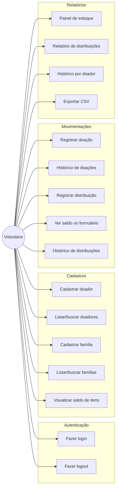
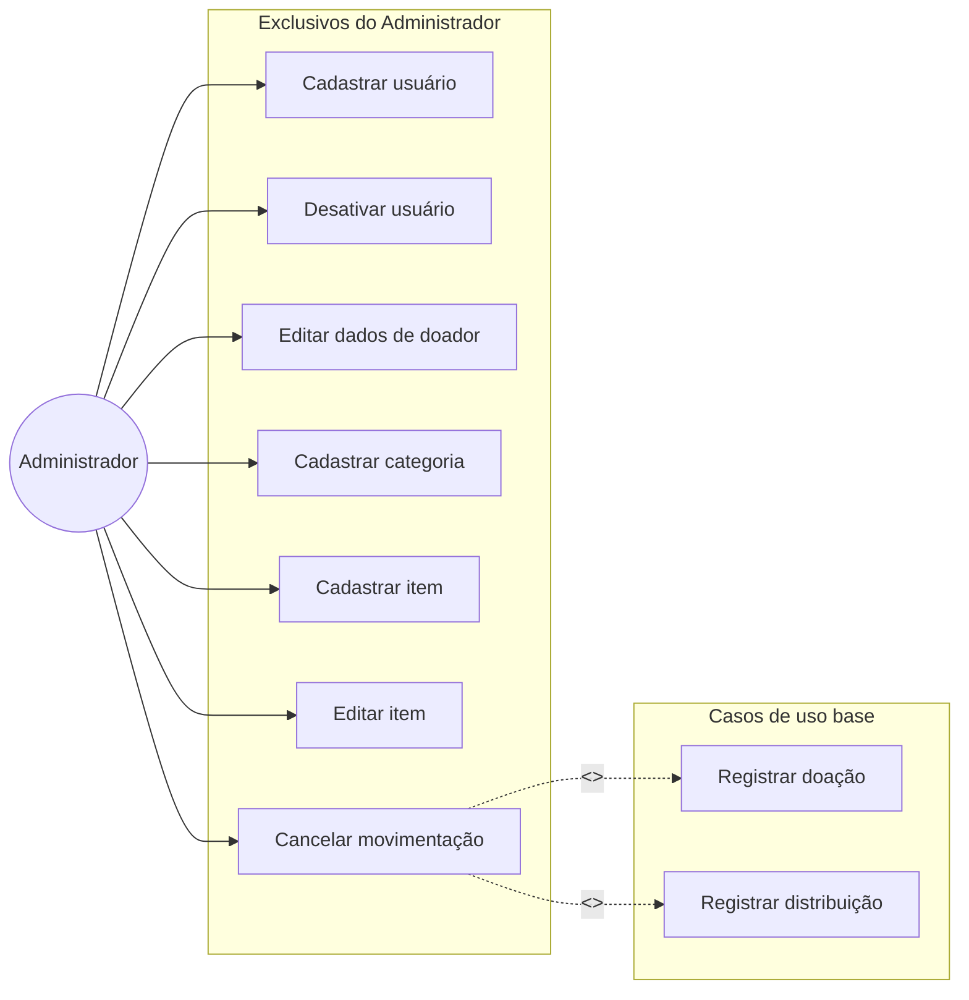
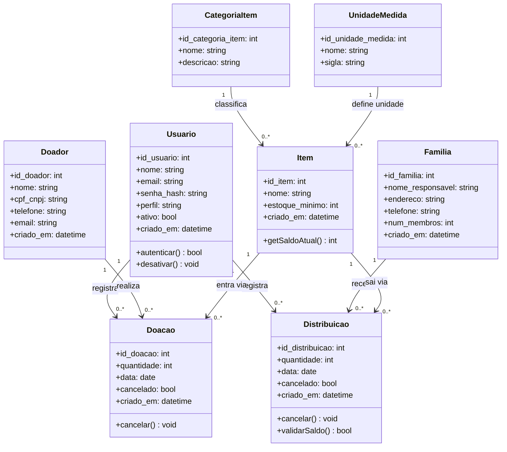

# Diagramas UML — Conecta Social

**Equipe:**
- Alexandre Victoriano Ribeiro Ulhoa — RA 2840482423007
- Daniel Souza Monteiro de Carvalho — RA 2840482211052
- Cintia Marcelo de Oliveira — RA 2840482421017
- Antonio Pires Felipe — RA 2840482211003
- Luiz Henrique Neres — RA 2840482423005

**Entrega:** E3 — Modelagem de Dados e UML  
**Semestre:** 2026/2

---

## 1. Diagrama de Casos de Uso

O sistema possui dois perfis de ator. O **Voluntário** executa os fluxos operacionais, enquanto o **Administrador** executa operações exclusivas de gestão. O cancelamento é um fluxo opcional que estende o registro de uma doação ou distribuição.

### Voluntário

### Administrador

---

## 2. Diagrama de Classes

---

## 3. Rastreabilidade — caso de uso → história do backlog

| Caso de uso | História(s) relacionada(s) (E2) |
|---|---|
| Fazer login | #1 |
| Fazer logout | #2 |
| Cadastrar usuário | #3 |
| Desativar usuário | #4 |
| Cadastrar doador | #5 |
| Listar/buscar doadores | #6 |
| Editar dados de doador | #7 |
| Cadastrar família | #8 |
| Listar/buscar famílias | #9 |
| Cadastrar categoria | #10 |
| Cadastrar item | #11 |
| Visualizar saldo de itens | #12 |
| Editar item | #13 |
| Registrar doação | #14 |
| Histórico de doações | #15 |
| Registrar distribuição | #16 |
| Ver saldo no formulário de distribuição | #17 |
| Histórico de distribuições | #18 |
| Cancelar movimentação | #19 |
| Painel de estoque por categoria | #20 |
| Relatório de distribuições | #21 |
| Histórico de doações por doador | #22 |
| Exportar relatório em CSV | #23 |

### Classes × Histórias do backlog

| Classe | Histórias relacionadas |
|---|---|
| `Usuario` | #1, #2, #3, #4 |
| `Doador` | #5, #6, #7, #14, #15, #22 |
| `Familia` | #8, #9, #16, #18, #21, #23 |
| `CategoriaItem` | #10, #11, #12, #20 |
| `UnidadeMedida` | #11, #12, #13 |
| `Item` | #11, #12, #13, #14, #15, #16, #17, #18, #20, #21, #22, #23 |
| `Doacao` | #14, #15, #19, #22 |
| `Distribuicao` | #16, #17, #18, #19, #21, #23 |
